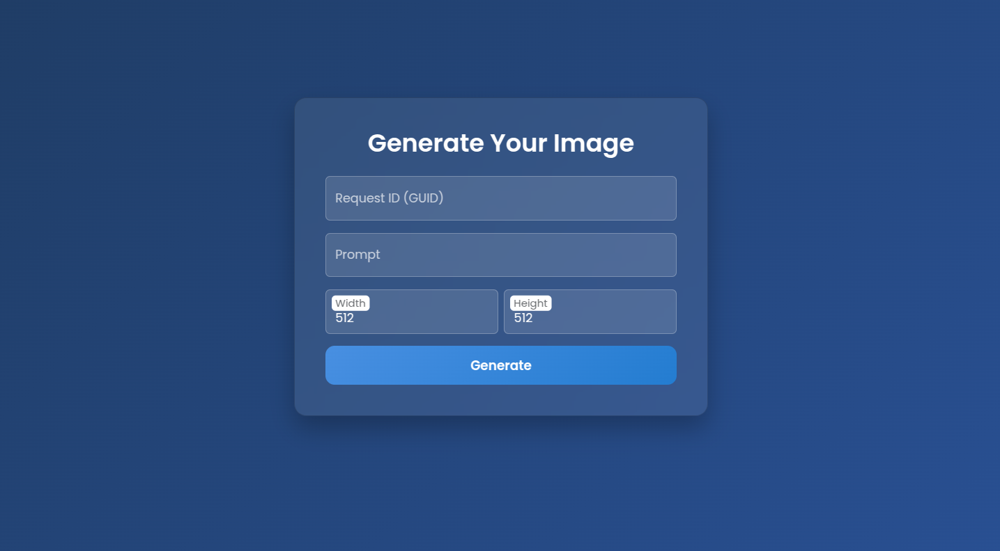

## Whisperwynd Story Generator (FlaskApp)


Whisperwynd-Story-Generator is a Flask-based web application for AI-powered image generation, HTML-to-PDF conversion, and Azure Blob cloud storage.

---

## Overview

This application enables users to:

- Generate AI images via the **RunPod API**
- Convert HTML to PDF using **WeasyPrint**
- Store files on **Azure Blob Storage**
- Interact through a **simple web UI** or **REST API**

---

## Requirements

- Python 3.8+
- Flask
- requests
- weasyprint
- azure-storage-blob

Install them via:

```bash
pip install -r app/requirements.txt
```

---

## Interface Preview

The interface allows inputting prompts, triggering image generation, and downloading results:



---

## Project Structure

```
Whisperwynd-Story-Generator/
├── app/
│   ├── app.py                # Main Flask application
│   ├── GetUUID.py            # UUID generator script
│   ├── To_PDF.py             # Optional script for PDF conversion
│   ├── requirements.txt      # Python dependencies
│   ├── templates/
│   │   └── index.html        # Web interface template
│   └── static/
│       ├── screenshot.png    # Preview image
│       └── generated_images/ # Folder for output images/PDFs
└── README.md                  # Project documentation
```

---

## Setup Instructions

### 1. Clone the Repository

```bash
git clone https://github.com/BhaskarDasari/Whisperwynd-Story-Generator.git
cd Whisperwynd-Story-Generator/app
```

### 2. Configure `.env`

Create a `.env` file based on `.env.example` and add:

```
API_URL=your_runpod_url
BEARER_TOKEN=your_runpod_token
AZURE_CONN_STR=your_azure_blob_connection_string
CONTAINER_NAME=images
```

### 3. Generate a UUID

```bash
python GetUUID.py
```

Copy and use this UUID for requests.

### 4. Run the App

```bash
python app.py
```

Then open [http://127.0.0.1:5000](http://127.0.0.1:5000) in your browser.

---

## How It Works

### 🔹 Image Generation Workflow

1. User submits a **prompt** and **UUID**.
2. App starts a job via RunPod API.
3. It polls until job is complete.
4. Downloads the image (from URL or base64).
5. Saves to disk and uploads to Azure Blob.
6. Returns both local and Azure URLs.

### 🔹 HTML to PDF Workflow

1. User sends HTML content + UUID.
2. WeasyPrint converts it into PDF.
3. The file is saved and uploaded.
4. Azure PDF link is returned.

---

## API Endpoints

### 🔸 `/generate` — Generate Image

**POST JSON:**
```json
{
  "request_id": "uuid",
  "prompt": "A dragon flying over mountains",
  "width": 512,
  "height": 512
}
```

**Response:**
```json
{
  "status": "success",
  "image_url": "/generated_images/uuid.png",
  "blob_url": "https://<azure>/uuid.png"
}
```

---

### 🔸 `/convert_html_to_pdf` — Convert HTML to PDF

**POST JSON:**
```json
{
  "request_id": "uuid",
  "html": "<h1>Hello PDF</h1><p>This is a test.</p>"
}
```

**Response:**
```json
{
  "status": "success",
  "pdf_blob_url": "https://<azure>/uuid.pdf"
}
```

---

## Tips & Best Practices

- Use a **new UUID** for each operation to prevent overwriting.
- **.env** file must be properly configured for Azure + RunPod access.
- Keep `.env` secure and untracked (Set `.gitignore`).
- Test the endpoints.
---
